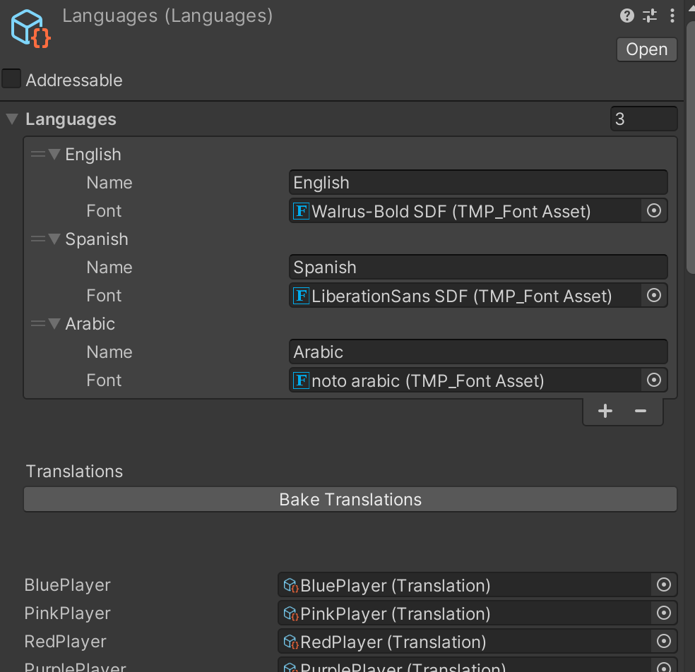
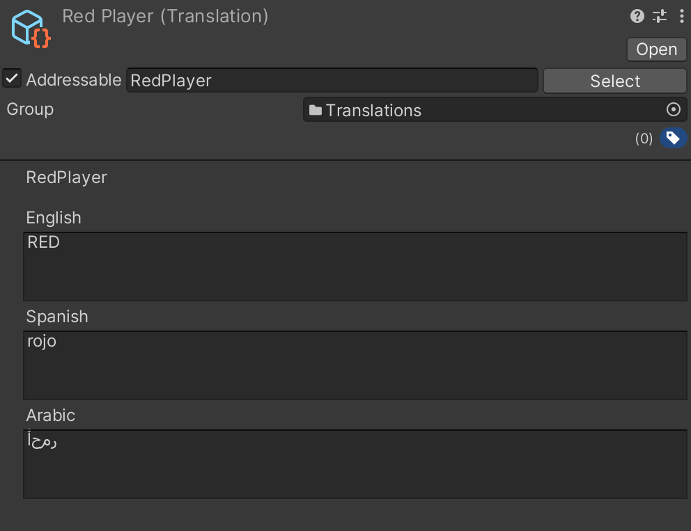
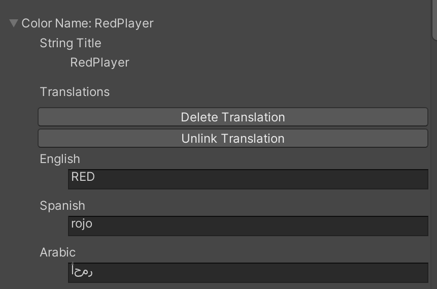
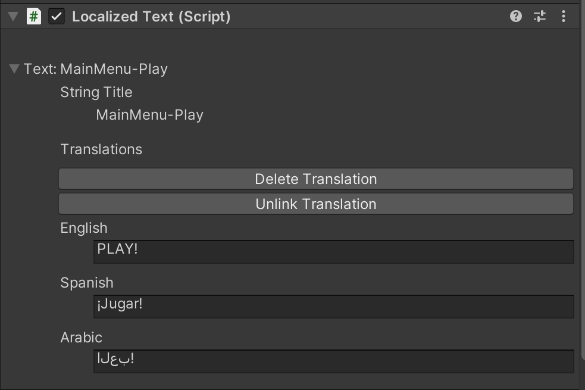

# unity-localization
A personal project for creating my own localization system. This isn't production ready.

## Interface

The system requires that a "Languages" scriptable object exists:



This contains the languages currently available, and the fonts they'll use for text. Below, is a list of all of the translations currently made in the project.

Each translation will have a text field for each language currently in the languages list.



Each translation file will be loaded and unloaded from memory using the addressables package for language changes. This way, only strings for the selected language exist in memory during gameplay.

There are two classes used at runtime, LocalizedString is a wrapper around the normal string class. It's given a custom inspector that allows the user to create, delete, and update translations.



LocalizedText is a wrapper around TextMeshPro text, which will automatically update it's text based on language changes.



In code, both can be treated like the classes they wrap.

```
[SerializeField] LocalizedText text;
[SerializeField] LocalizedString message1;
[SerializeField] LocalizedString message2;

void Start()
{
    text.text = message1 + " " + message2;
}
```

LocalizedString provides operator overloads for string concatenation with both other LocalizedStrings, and normal strings. If a LocalizedString has an associated Translation, then concatenations made with that LocalizedString will still update when the language changes.

```
[SerializeField] LocalizedText text;
[SerializeField] LocalizedString red;
[SerializeField] LocalizedString eliminated;
[SerializeField] LocalizedString blue;

void Awake()
{
    text.text = red + eliminated + blue;
    languageController.Instance.SetLanguage("Español");
    // text.text == "Rojo eliminado Azul";
}
```

This does pose difficulties with grammar, since languages won't necessarily have a 1 to 1 word translation.

If you want to access the TextMeshProUGUI LocalizedText wraps, use `text.tmp`.
